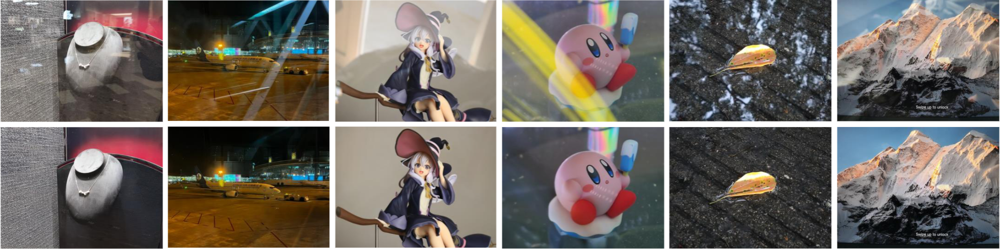

<div align="center">
</img>
</div>

# Dereflection Any Image with Diffusion Priors and Diversified Data
### [Project Page](https://abuuu122.github.io/DAI.github.io/) | [Paper]() | [Data]() | [](https://colab.research.google.com/drive/129uKcCNfoR2sIn5RifqhYGpB0xa2tdsH?usp=sharing)

📖[Dereflection Any Image with Diffusion Priors and Diversified Data](https://gaussianobject.github.io/)

[Jichen Hu](https://abuuu122.github.io/DAI.github.io/)<sup>1*</sup>, [Chen Yang](https://scholar.google.com/citations?hl=zh-CN&user=StdXTR8AAAAJ)<sup>1*</sup>, [Zanwei Zhou](https://abuuu122.github.io/DAI.github.io/)<sup>1</sup>, [Jiemin Fang](https://jaminfong.cn/)<sup>2</sup>, [Xiaokang Yang](https://abuuu122.github.io/DAI.github.io/)<sup>1</sup>, [Qi Tian](https://www.qitian1987.com/)<sup>2</sup>, [Wei Shen](https://shenwei1231.github.io/)<sup>1✉</sup>,    
<sup>1</sup>MoE Key Lab of Artificial Intelligence, AI Institute, SJTU &emsp; <sup>2</sup>Huawei Inc. &emsp;   
<sup>*</sup>Equal contribution. &emsp; <sup>✉</sup>Corresponding author.

<div align="center">
</img>
</div>

## 🚀Setup

### Environment
Dereflection Any Image is tested with CUDA 11.8 and python 3.9. All the required packages are listed in `requirements.txt`. You can install them with

```sh
pip install -r requirements.txt
```


### Weights
Our scripts will automatically download the pretrained weights from Huggingface.

You can also download the weights by [Google Drive](https://drive.google.com/drive/folders/1WFczJ0LgVbFfVQym7FLGW-f5iU7G1Rr-?usp=drive_link) or [Huggingface](https://huggingface.co/JichenHu/dereflection-any-image-v0)

## 💪Usage

### Inference
Put images in the "input" dir, and run:
```sh
python run.py --input_dir ./input/ --result_dir ./result/ --concat_dir ./concat/ 
```
or use script run.sh directly.

### Gradio Demo
```
python demo.py
```

## 🌏 Citation

If you find Derefelection Any Image useful for your work please cite:

```text
```
